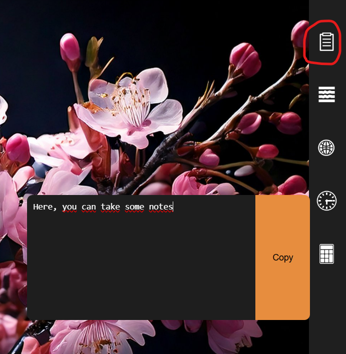
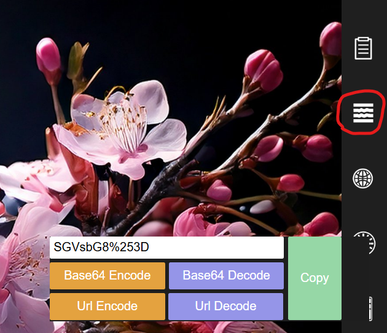
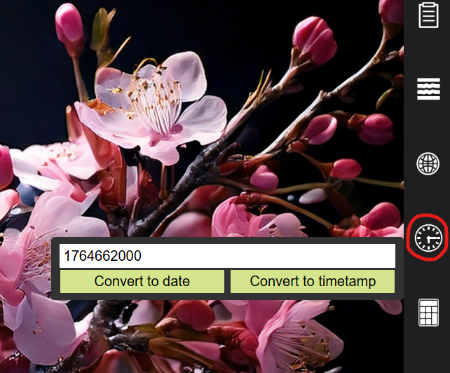
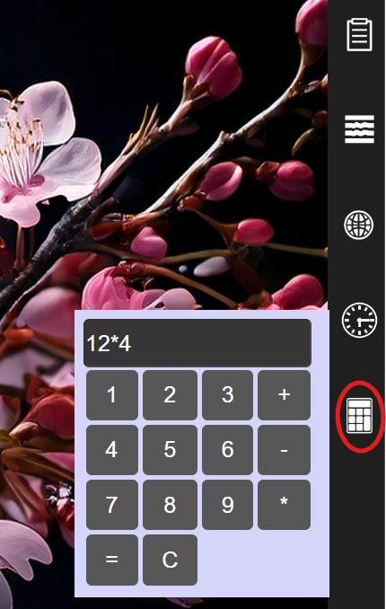

# osexpand

osexpand is a program that uses ElectronJS to behave like any other application. Except that this one is there to provide a few useful tools for everyday life, such as an encoder, a quick notepad, and more. 

osexpand takes up very little space on the screen, allowing you to use your computer as usual despite it being there.

osexpand uses ElectronJS and does not use specific OS APIs, so it is cross-platform.


## How to use it ?

After cloning the repo, you need to install the dependencies with a simple npm command (make sure you have NodeJS installed) (also make sure you are in the folder of the repo).

```bash
npm install
```

Now that the environment is complete, you can launch the program with 

```bash
npx electron .
```


## Presentation of tools

**All osexpand tools have a temporary backup system. All values you enter will remain in memory until the program is closed, for all tools.**


#### Mini editor

You can write text there that will remain in memory as long as the program remains open. You can also click the "Copy" button to copy the entire text to your clipboard.




#### Encoder / Decoder

Here, you can encode and decode data in both base64 and URL encoding algorithm, use multi encoding and mix them together.




#### Webviewer

This allows you to view certain websites via an iframe. Please note: many websites do not allow their use in iframes, so don't be surprised if you sometimes get an error message.


#### Timestamp converter

Here, you can simply convert timestamps to date and vice versa.




#### Calculator

Just a calculator.




## How to close it ?

osexpand does not have a close button. You must therefore right-click on its icon in the taskbar and close it from there. You can also press Ctrl + c / Cmd + c in the terminal where the program is running.
